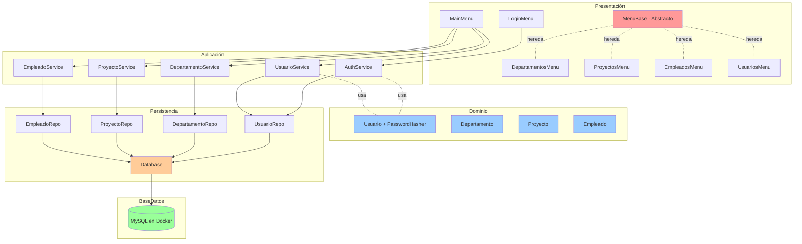
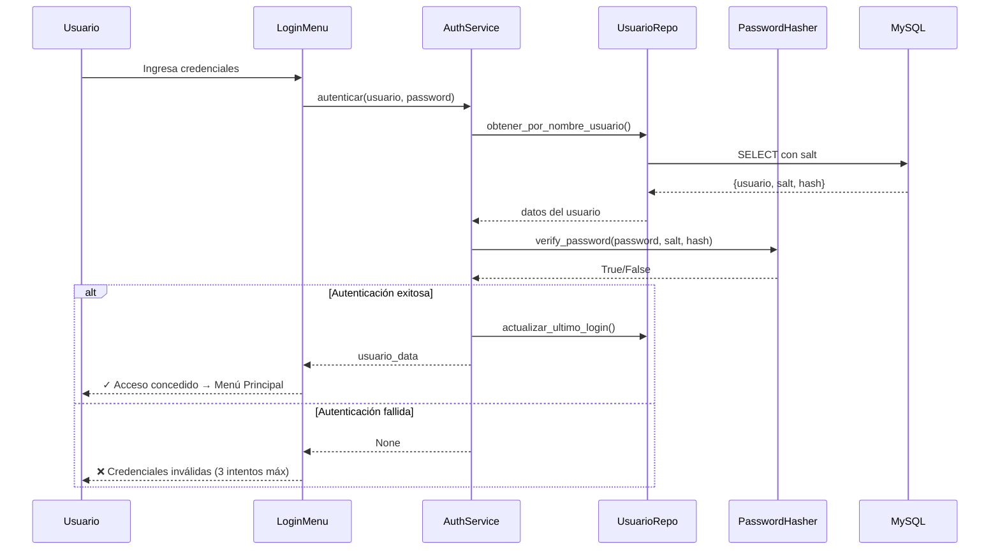
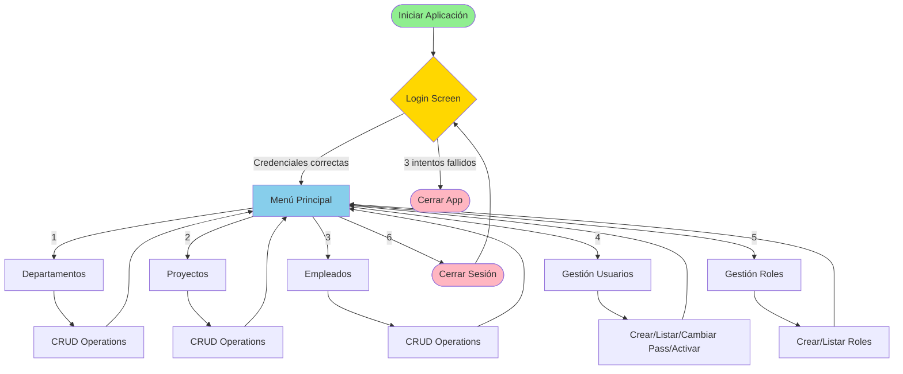
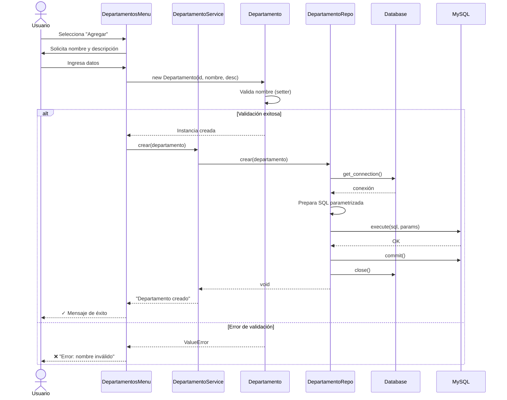
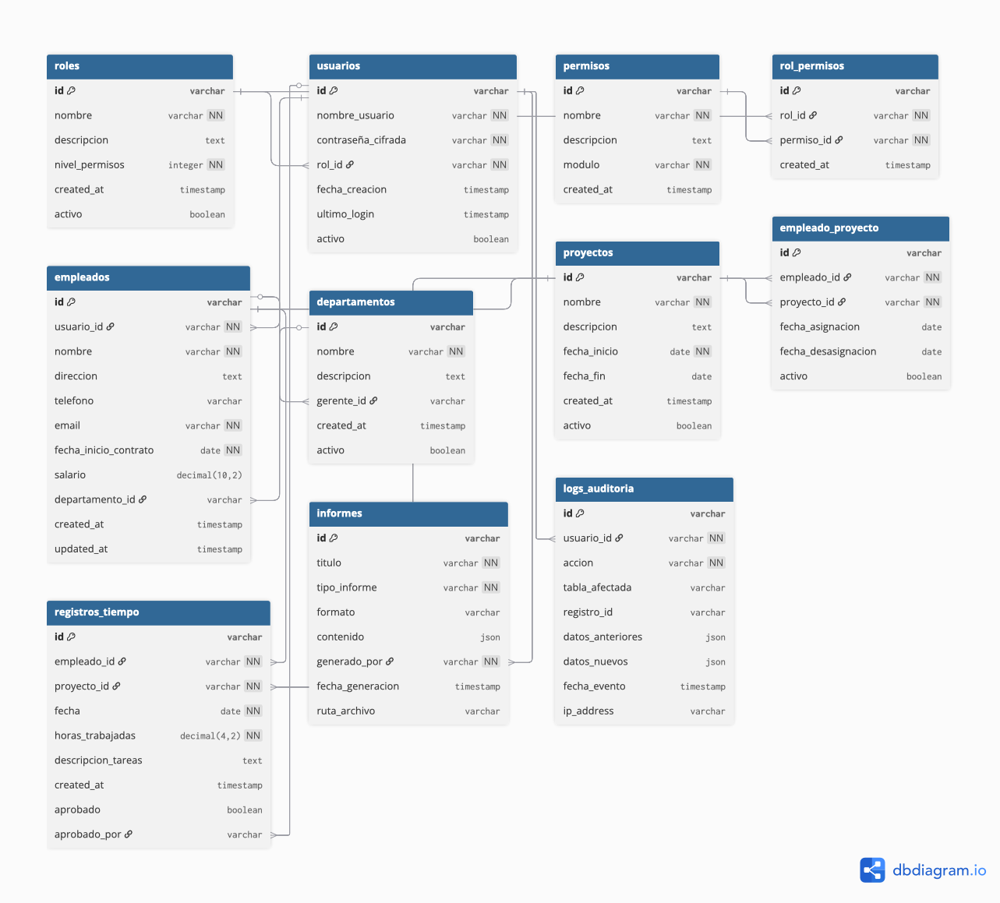

# EcoTech Management — Sistema de Gestión con POO Segura

**Aplicación de consola con autenticación, arquitectura en 4 capas, Docker y MySQL**

[](https://python.org)
[](https://www.mysql.com/)
[](https://www.docker.com/)

---

## 📋 Tabla de Contenidos

- [Descripción](#descripción)
- [Quick Start](#-quick-start)
- [Arquitectura](#-arquitectura)
- [Sistema de Autenticación](#-sistema-de-autenticación)
- [Integración con API Pública](#-integración-con-api-pública-de-datos-ambientales)
- [Docker y Migraciones](#-docker-y-migraciones)
- [Seguridad](#-seguridad)
- [Estructura del Proyecto](#-estructura-del-proyecto)
- [Desarrollo](#-desarrollo)
- [Base de Datos](#️-base-de-datos)

---

## Descripción

Sistema completo de gestión empresarial con:
- ✅ **Autenticación** con usuario y contraseña
- ✅ **4 capas** (Presentación, Aplicación, Dominio, Persistencia)
- ✅ **POO** con herencia, polimorfismo, encapsulamiento
- ✅ **MySQL en Docker** con auto-inicialización
- ✅ **Migraciones** con Alembic
- ✅ **Seguridad** con salt + SHA-256 hashing
- ✅ **Gestión** de Departamentos, Proyectos, Empleados, Usuarios y Roles
- ✅ **API Pública** integrada orgánicamente para evaluación ambiental

---

## 🚀 Quick Start

### Prerequisitos

- Docker y Docker Compose
- Python 3.8+

### Instalación y Ejecución

```bash
# 1. Clonar repositorio
git clone <repo-url>
cd EcoTechSolutions

# 2. Crear entorno virtual
python3 -m venv venv
source venv/bin/activate  # En Windows: venv\Scripts\activate

# 3. Instalar dependencias
pip install -r requirements.txt

# 4. Levantar MySQL en Docker
docker-compose up -d
sleep 15  # Esperar que MySQL esté listo

# 5. Inicializar roles y usuario admin
python init_data.py

# 6. Ejecutar aplicación
python main.py
```

### Credenciales por Defecto

```
Usuario: admin
Contraseña: admin123
```

⚠️ **Importante:** Cambiar la contraseña del administrador después del primer login.

---

## 🏗️ Arquitectura

### Diagrama de Arquitectura en Capas



### Estructura de Capas

| Capa | Responsabilidad | Archivos |
|------|----------------|----------|
| **Presentación** | Menús e interfaz de usuario | `presentacion/menus.py`, `auth_menus.py` |
| **Aplicación** | Coordinación de lógica | `aplicacion/services.py`, `auth_services.py` |
| **Dominio** | Modelos y reglas de negocio | `dominio/models.py`, `auth_models.py`, `security.py` |
| **Persistencia** | Acceso a base de datos | `persistencia/repositorios.py`, `auth_repositorios.py` |

---

## 🔐 Sistema de Autenticación

### Flujo de Autenticación



### Hashing de Contraseñas con Salt

#### Proceso de Creación

```python
# 1. Usuario ingresa contraseña
password = "miPassword123"

# 2. Sistema genera salt único (32 bytes aleatorios)
salt = PasswordHasher.generate_salt()
# Ejemplo: "Xp2k9Qw7Zn3mL5vB8cR6tY4uI1oP0aS="

# 3. Combina contraseña + salt y hashea con SHA-256
hash = PasswordHasher.hash_password(password, salt)
# hash = sha256("miPassword123Xp2k9Qw7Zn3mL5vB8cR6tY4uI1oP0aS=")

# 4. Guarda en BD: salt y hash (NO la contraseña)
INSERT INTO usuarios (..., salt, contrasena_cifrada) VALUES (..., salt, hash)
```

#### ¿Por qué Salt?

**Sin salt:**
```
Usuario A: password123 → hash: abc123def456
Usuario B: password123 → hash: abc123def456  ☠️ (mismo hash)
```

**Con salt único:**
```
Usuario A: password123 + saltA → hash: abc123def456
Usuario B: password123 + saltB → hash: xyz789ghi012  ✅ (hash diferente)
```

### Gestión de Usuarios y Roles

**Menú de Gestión de Usuarios:**
- Crear usuario con rol
- Listar usuarios
- Cambiar contraseña
- Activar/desactivar usuarios

**Sistema de Roles con Control de Acceso (RBAC):**

| Rol | Nivel de Permisos | Acceso al Menú |
|-----|------------------|----------------|
| **Administrador** | 10 | 🔓 **Acceso completo**: Ver Proyectos, Gestión de Departamentos, Gestión de Proyectos, Gestión de Empleados, **Gestión de Usuarios**, **Gestión de Roles**, Cambiar contraseña |
| **Gerente** | 7 | 🔒 **Gestión operativa**: Ver Proyectos (completo), Gestión de Departamentos, Gestión de Proyectos, Gestión de Empleados, Cambiar contraseña <br> ❌ Sin acceso a: Gestión de Usuarios, Gestión de Roles |
| **Empleado** | 3 | 🔒 **Solo consulta**: Ver Proyectos (solo lectura), Evaluar calidad del aire, Cambiar contraseña <br> ❌ Sin acceso a: Gestión de Departamentos, Gestión de Proyectos (crear/editar/eliminar), Gestión de Empleados, Gestión de Usuarios, Gestión de Roles |

**Características de seguridad RBAC:**
- ✅ Menú dinámico: solo muestra opciones permitidas según el rol
- ✅ Validación en ejecución: bloquea acceso no autorizado incluso con opción directa
- ✅ Modo solo lectura para Empleados: pueden consultar proyectos pero no modificar
- ✅ Mensajes de error específicos: "❌ No tiene permisos para acceder a esta opción"
- ✅ Todos los usuarios pueden cambiar su propia contraseña

**Usuarios de prueba para testing:**
```bash
# Crear usuarios de prueba con diferentes roles
python scripts/test_rbac.py

# Usuarios disponibles:
# - admin / admin123 (Administrador - Nivel 10)
# - gerente_test / gerente123 (Gerente - Nivel 7)
# - empleado_test / empleado123 (Empleado - Nivel 3)
```

---

## 🐳 Docker y Migraciones

### Docker Compose

```yaml
services:
  mysql:
    image: mysql:8.0
    container_name: ecotech_mysql
    environment:
      MYSQL_DATABASE: ecotech_management
      MYSQL_USER: ecotech_user
      MYSQL_PASSWORD: ecotech_pass
    ports:
      - "3306:3306"
    volumes:
      - mysql_data:/var/lib/mysql
      - ./script.sql:/docker-entrypoint-initdb.d/script.sql
```

### Comandos Docker Esenciales

```bash
# Iniciar MySQL
docker-compose up -d

# Ver logs
docker-compose logs -f mysql

# Detener (conserva datos)
docker-compose down

# Detener y eliminar datos ⚠️
docker-compose down -v

# Conectarse a MySQL
docker exec -it ecotech_mysql mysql -u ecotech_user -pecotech_pass ecotech_management

# Ver estado
docker-compose ps
```

### Migraciones con Alembic

```bash
# Crear migración automática (detecta cambios en models_sqlalchemy.py)
alembic revision --autogenerate -m "descripción del cambio"

# Aplicar migraciones
alembic upgrade head

# Revertir última migración
alembic downgrade -1

# Ver historial
alembic history

# Ver migración actual
alembic current
```

### Variables de Entorno (.env)

```bash
DB_HOST=127.0.0.1
DB_PORT=3306
DB_USER=ecotech_user
DB_PASSWORD=ecotech_pass
DB_NAME=ecotech_management

# API Pública de Datos Ambientales (OpenWeatherMap)
API_KEY=tu_api_key_de_openweathermap
```

**Obtener API Key Gratuita:**
1. Regístrate en [OpenWeatherMap](https://openweathermap.org/api)
2. Activa la API gratuita (Air Pollution API)
3. Copia tu API key y agrégala al archivo `.env`

---

## 🛡️ Seguridad

### Principios Implementados

#### 1. **Consultas Parametrizadas** (Prevención SQL Injection)

```python
# ✅ SEGURO
sql = "SELECT * FROM usuarios WHERE nombre_usuario = %s"
cursor.execute(sql, (nombre_usuario,))

# ❌ INSEGURO
sql = f"SELECT * FROM usuarios WHERE nombre_usuario = '{nombre_usuario}'"
cursor.execute(sql)
```

#### 2. **Hashing SHA-256 con Salt**
- Salt único por usuario (32 bytes aleatorios base64)
- Contraseñas nunca almacenadas en texto plano
- Verificación segura con comparación de hashes

#### 3. **Validación en Capa de Dominio**

```python
@nombre.setter
def nombre(self, value):
    if not value or len(value) < 2:
        raise ValueError("Nombre debe tener al menos 2 caracteres")
    self._nombre = value
```

#### 4. **Encapsulamiento**
- Atributos privados con `_`
- Acceso controlado mediante properties
- Validación en setters

#### 5. **Manejo de Excepciones**

```python
try:
    self.repo.crear(usuario)
    print("✓ Usuario creado")
except Exception as e:
    print(f"Error: {e}")
finally:
    conn.close()  # Cierre seguro
```

#### 6. **Protección de Sesión**
- Máximo 3 intentos de login
- Contraseñas ocultas con `getpass`
- Actualización de `ultimo_login`
- Usuarios inactivos no pueden autenticarse

---

## 📁 Estructura del Proyecto

```
EcoTechSolutions/
├── presentacion/
│   ├── __init__.py
│   ├── menu_base.py          # Clase abstracta MenuBase
│   ├── menus.py               # MainMenu, DepartamentosMenu, ProyectosMenu, EmpleadosMenu
│   └── auth_menus.py          # LoginMenu, UsuariosMenu, RolesMenu
├── aplicacion/
│   ├── __init__.py
│   ├── services.py            # DepartamentoService, ProyectoService, EmpleadoService
│   ├── auth_services.py       # AuthService, UsuarioService, RolService
│   └── api_client.py          # EcoAPIClient (integración con OpenWeatherMap)
├── dominio/
│   ├── __init__.py
│   ├── models.py              # Departamento, Proyecto, Empleado
│   ├── auth_models.py         # Usuario, Rol
│   └── security.py            # PasswordHasher (salt + SHA-256)
├── persistencia/
│   ├── __init__.py
│   ├── db.py                  # Database (conexión PyMySQL)
│   ├── repositorios.py        # DepartamentoRepo, ProyectoRepo, EmpleadoRepo
│   ├── auth_repositorios.py   # UsuarioRepo, RolRepo
│   └── models_sqlalchemy.py   # Modelos SQLAlchemy para migraciones
├── alembic/
│   ├── versions/              # Migraciones
│   └── env.py                 # Configuración Alembic
├── scripts/
│   ├── init_data.py           # Script de inicialización (roles + admin)
│   ├── test_db.py             # Test de conexión
│   ├── test_app.py            # Test CRUD + API
│   ├── test_auth.py           # Test autenticación
│   ├── test_eco_api.py        # Test integración API ambiental
│   └── test_integracion_organica.py  # Test flujo orgánico de API
├── docker-compose.yml         # MySQL containerizado
├── script.sql                 # Esquema SQL (12 tablas con salt)
├── .env                       # Credenciales (git-ignored)
├── .gitignore
├── requirements.txt           # Dependencias Python
├── alembic.ini                # Configuración Alembic
└── README.md                  # Esta documentación
```

---

## 🌍 Integración con API Pública de Datos Ambientales

### Descripción

EcoTech Solutions integra **orgánicamente** la **OpenWeatherMap Air Pollution API** para proporcionar datos en tiempo real sobre calidad del aire durante la gestión de proyectos. La funcionalidad está completamente integrada en el flujo de trabajo, sin necesidad de scripts externos.

**Integración Orgánica:**
- ✅ Evaluación proactiva durante creación de proyectos
- ✅ Opción dedicada en menú de proyectos
- ✅ Recomendaciones contextuales basadas en datos
- ✅ Decisiones informadas antes de aprobar ubicaciones

**Casos de Uso:**
- **Ubicación de oficinas:** Evaluar calidad del aire antes de abrir nuevas sedes
- **Proyectos ambientales:** Monitorear impacto ambiental en zonas de operación
- **Bienestar de empleados:** Garantizar ambientes laborales saludables
- **Reportes de sustentabilidad:** Datos para stakeholders y certificaciones

### Características

✅ **Integrada en menú de proyectos** - No requiere comandos externos  
✅ **Consulta de calidad del aire** por ciudad o coordenadas  
✅ **Índice AQI** (Air Quality Index) de 1 a 5  
✅ **Medición de 7 contaminantes:** CO, NO₂, O₃, SO₂, PM2.5, PM10, NH₃  
✅ **Recomendaciones automáticas** para proyectos según AQI  
✅ **Manejo robusto de errores** (timeout, conexión, API key inválida)  

### Configuración

#### 1. Obtener API Key

1. Regístrate en [OpenWeatherMap](https://openweathermap.org/api)
2. Activa **Air Pollution API** (plan gratuito incluye 1,000 llamadas/día)
3. Copia tu API key del dashboard

#### 2. Configurar Variable de Entorno

**Opción A: Archivo `.env` (Recomendado)**

```bash
# Copiar archivo de ejemplo
cp .env.example .env

# Editar .env y reemplazar tu_api_key_aqui con tu clave real
# API_KEY=abc123def456ghi789...
```

**Opción B: Export en Terminal**

```bash
export API_KEY='tu_api_key_de_openweathermap_aqui'
```

### Uso en la Aplicación

#### 🎯 Método Principal: Integración Orgánica

La API está **completamente integrada** en el menú de proyectos. No requiere scripts externos:

**Flujo A - Evaluar durante creación de proyecto:**

```bash
$ python main.py
🌱 ECOTECH SOLUTIONS - Gestión Empresarial Sustentable

Usuario: admin
Contraseña: ****

Menú Principal → 2. Menú de Proyectos 🌍
Menú Proyectos → 1. Agregar

Nombre: Expansión Santiago Norte
Descripción: Nueva oficina comercial
Fecha inicio: 2025-12-01
Fecha fin: 2026-06-30

💡 EcoTech Solutions - Evaluación Ambiental
¿Desea evaluar calidad del aire en la ubicación del proyecto? (s/n): s

Ciudad del proyecto: Santiago
Código de país [CL]: CL

🔍 Consultando calidad del aire en Santiago, CL...

──────────────────────────────────────────────────────────────
 REPORTE DE CALIDAD DEL AIRE - SANTIAGO
──────────────────────────────────────────────────────────────

📊 Índice de Calidad (AQI): 2/5 - Aceptable

🔬 Contaminantes principales (μg/m³):
  • PM2.5 (Partículas finas): 15.2
  • PM10 (Partículas):        22.8
  • NO₂ (Dióxido nitrógeno):  18.5

──────────────────────────────────────────────────────────────
 RECOMENDACIÓN PARA PROYECTOS ECOTECH
──────────────────────────────────────────────────────────────

✅ UBICACIÓN APROBADA
  • Excelente calidad del aire
  • Ambiente saludable para equipo de trabajo
  • Alineado con valores de sustentabilidad EcoTech

Proyecto creado ✓
```

**Flujo B - Evaluación directa:**

```bash
Menú Proyectos → 7. 🌍 Evaluar calidad del aire en ubicación

============================================================
 🌍 EVALUACIÓN DE CALIDAD DEL AIRE - ECOTECH SOLUTIONS
============================================================

Evalúe condiciones ambientales antes de iniciar proyectos
o expandir operaciones a nuevas ubicaciones.

Ciudad a evaluar: Valparaíso
Código de país [CL]: CL

🔍 Consultando calidad del aire en Valparaíso, CL...
[Muestra reporte completo + recomendación]

[Presione Enter para continuar]
```

#### 🔧 Uso Programático (Avanzado)

Para desarrollo o scripts personalizados:

```python
from aplicacion.services import ProyectoService
from aplicacion.api_client import EcoAPIClient

# Vía servicio
service = ProyectoService()
datos = service.obtener_calidad_aire_por_ciudad('Santiago', 'CL')

if datos:
    print(f"AQI: {datos['aqi']}/5 - {EcoAPIClient.interpretar_aqi(datos['aqi'])}")
    print(f"PM2.5: {datos['pm2_5']} μg/m³")
    print(f"PM10: {datos['pm10']} μg/m³")
```

### Índice de Calidad del Aire (AQI)

| AQI | Categoría | Descripción |
|-----|-----------|-------------|
| 1 | **Bueno** | Calidad del aire satisfactoria, sin riesgo |
| 2 | **Aceptable** | Calidad aceptable, grupos sensibles pueden experimentar efectos leves |
| 3 | **Moderado** | Grupos sensibles pueden experimentar efectos en la salud |
| 4 | **Pobre** | Toda la población puede experimentar efectos en la salud |
| 5 | **Muy Pobre** | Alerta de salud, toda la población afectada |

### Contaminantes Medidos

- **CO** (Monóxido de carbono): Gas inodoro producido por combustión incompleta
- **NO₂** (Dióxido de nitrógeno): Gas tóxico de emisiones vehiculares
- **O₃** (Ozono): Irritante respiratorio formado por reacciones fotoquímícas
- **SO₂** (Dióxido de azufre): Gas de combustión de combustibles fósiles
- **PM2.5** (Partículas finas): Partículas < 2.5 μm, penetran pulmones profundamente
- **PM10** (Partículas): Partículas < 10 μm, causan problemas respiratorios
- **NH₃** (Amoníaco): Gas de actividades agrícolas y ganaderas

### Casos de Uso Empresariales

#### Caso 1: Evaluación de Nueva Sede

**Escenario:** EcoTech planea abrir oficina en Concepción

**Flujo en la aplicación:**
```
1. Menú Proyectos → Opción 7 (Evaluar calidad del aire)
2. Ingresar: Concepción, CL
3. Sistema consulta API y muestra:
   • AQI: 2/5 - Aceptable
   • PM2.5: 12.3 μg/m³
   • Recomendación: ✅ UBICACIÓN APROBADA
4. Decisión: Proceder con apertura de sede
```

#### Caso 2: Expansión Regional

**Escenario:** Evaluar 3 ciudades candidatas para expansión

**Flujo:**
```
Menú Proyectos → Opción 7 (repetir para cada ciudad)

Valparaíso: AQI 2/5 ✅ Aprobada
Santiago:   AQI 3/5 ⚠️  Condicional (purificadores)
Antofagasta: AQI 1/5 ✅ Aprobada

Decisión: Priorizar Antofagasta y Valparaíso
```

#### Caso 3: Validación de Proyecto Crítico

**Escenario:** Proyecto requiere ubicación en ciudad específica

**Flujo:**
```
1. Crear proyecto con evaluación
2. AQI = 4 (Pobre)
3. Sistema advierte: ❌ NO RECOMENDADA
4. Opciones:
   a) Cancelar proyecto
   b) Implementar trabajo remoto
   c) Medidas de mitigación extremas
```

### Testing de la Integración

```bash
# Test de integración orgánica (simula flujo de usuario)
python scripts/test_integracion_organica.py

# Test completo de API (todas las funcionalidades)
python scripts/test_eco_api.py

# Test general de la aplicación (incluye API)
python scripts/test_app.py
```

**Cobertura de tests:**
- ✅ Integración orgánica en menú de proyectos
- ✅ Cliente API directo con manejo de errores
- ✅ Servicio integrado (ProyectoService)
- ✅ Casos de uso reales (evaluación de ubicaciones)
- ✅ Recomendaciones basadas en AQI

### Arquitectura

```
Presentación (Menus)
        ↓
Aplicación (ProyectoService)
        ↓
    EcoAPIClient ──→ OpenWeatherMap API
        ↓
    Respuesta JSON
        ↓
  Datos parseados
```

### Manejo de Errores

El cliente incluye manejo robusto de errores:

| Error | Causa | Manejo |
|-------|-------|--------|
| `ValueError` | API_KEY no configurada | Mensaje instructivo al usuario |
| `Timeout` | API no responde en tiempo límite | Retorna `None`, logs error |
| `ConnectionError` | Sin conexión a internet | Retorna `None`, logs error |
| `HTTPError 401` | API key inválida | Logs error HTTP, retorna `None` |
| `HTTPError 429` | Límite de llamadas excedido | Logs error, retorna `None` |

### Límites del Plan Gratuito

- **1,000 llamadas/día** (suficiente para uso normal)
- **60 llamadas/minuto**
- Sin límite de ciudades consultadas

### Solución de Problemas

**Error: API_KEY no configurada**
```bash
# Configurar variable de entorno
export API_KEY='tu_clave_de_openweathermap'

# O agregar al archivo .env
echo "API_KEY=tu_clave_aqui" >> .env
```

**Error: 401 Unauthorized**
- Tu API key es inválida o expiró
- Verifica en: https://home.openweathermap.org/api_keys
- Genera una nueva si es necesario

**Error: Ciudad no encontrada**
- Verifica ortografía del nombre de la ciudad
- Prueba con nombre en inglés (ej: "Valparaiso" en vez de "Valparaíso")
- Usa código de país correcto (CL, AR, PE, etc.)

**Sin API_KEY configurada**
- La aplicación funciona normalmente
- Al intentar evaluar ubicación, muestra mensaje informativo
- El proyecto se puede crear sin evaluación ambiental

### Documentación Adicional

**API Externa:**
- [Air Pollution API](https://openweathermap.org/api/air-pollution) - Documentación completa
- [Geocoding API](https://openweathermap.org/api/geocoding-api) - Conversión ciudad → coordenadas
- [Pricing](https://openweathermap.org/price) - Plan gratuito: 1,000 llamadas/día

**Arquitectura:**
```
Presentación (ProyectosMenu)
        ↓
Aplicación (ProyectoService)
        ↓
    EcoAPIClient ──→ OpenWeatherMap API
        ↓
  Datos de Calidad del Aire
        ↓
Recomendación para Proyectos
```

---

## 💻 Desarrollo

### Agregar Nueva Funcionalidad

#### 1. Crear Modelo de Dominio

```python
# dominio/models.py
class Cliente:
    def __init__(self, id: str, nombre: str, email: str):
        self.id = id
        self.nombre = nombre
        self.email = email

    @property
    def email(self):
        return self._email

    @email.setter
    def email(self, value):
        if not value or "@" not in value:
            raise ValueError("Email inválido")
        self._email = value
```

#### 2. Crear Repositorio

```python
# persistencia/repositorios.py
class ClienteRepo:
    def crear(self, cliente):
        sql = "INSERT INTO clientes (id, nombre, email) VALUES (%s, %s, %s)"
        conn = Database.get_connection()
        try:
            with conn.cursor() as cur:
                cur.execute(sql, (cliente.id, cliente.nombre, cliente.email))
            conn.commit()
        finally:
            conn.close()
```

#### 3. Crear Servicio

```python
# aplicacion/services.py
class ClienteService:
    def __init__(self):
        self.repo = ClienteRepo()

    def crear(self, cliente):
        try:
            self.repo.crear(cliente)
            print("✓ Cliente creado")
        except Exception as e:
            print(f"Error: {e}")
```

#### 4. Crear Menú

```python
# presentacion/menus.py
class ClientesMenu(MenuBase):
    def mostrar(self):
        print("\n-- Menú Clientes --")
        print("1. Agregar")
        print("2. Mostrar Todos")
        # ...

    def ejecutar(self):
        # Implementación del menú
        pass
```

#### 5. Migración de BD

```bash
# Opción A: SQL directo
docker exec -it ecotech_mysql mysql -u ecotech_user -pecotech_pass ecotech_management -e "
CREATE TABLE clientes (
    id VARCHAR(50) PRIMARY KEY,
    nombre VARCHAR(200) NOT NULL,
    email VARCHAR(150) NOT NULL
);"

# Opción B: Migración con Alembic
# 1. Agregar modelo a models_sqlalchemy.py
# 2. alembic revision --autogenerate -m "Agregar tabla clientes"
# 3. alembic upgrade head
```

### Testing

```bash
# Test de conexión
python scripts/test_db.py

# Test CRUD
python scripts/test_app.py

# Test autenticación
python scripts/test_auth.py

# Test integración con API ambiental
python scripts/test_eco_api.py
```

### Comandos Útiles

```bash
# Ver estructura de tabla
docker exec -it ecotech_mysql mysql -u ecotech_user -pecotech_pass ecotech_management -e "DESC usuarios;"

# Backup de BD
docker exec ecotech_mysql mysqldump -u ecotech_user -pecotech_pass ecotech_management > backup.sql

# Restore de BD
docker exec -i ecotech_mysql mysql -u ecotech_user -pecotech_pass ecotech_management < backup.sql
```

---

## 📊 Diagramas

### Flujo de Usuario Completo



### Diagrama de Secuencia - Crear Departamento



---

## 📦 Dependencias

```txt
PyMySQL>=1.0.2          # Driver MySQL con soporte para queries parametrizadas
python-dotenv>=1.0.0    # Variables de entorno desde .env
alembic>=1.13.0         # Sistema de migraciones de BD
SQLAlchemy>=2.0.0       # ORM para migraciones (no para runtime)
cryptography>=46.0.0    # Autenticación segura con MySQL 8.0
requests>=2.31.0        # Cliente HTTP para consumo de APIs públicas
```

---

## 🎓 Cumplimiento de Requisitos

| Requisito | Estado | Implementación |
|-----------|--------|----------------|
| **Autenticación con login** | ✅ | `LoginMenu`, `AuthService`, salt + SHA-256 |
| **Gestión de usuarios** | ✅ | `UsuariosMenu`, `UsuarioService`, CRUD completo |
| **4 capas POO** | ✅ | Presentación, Aplicación, Dominio, Persistencia |
| **Clase abstracta** | ✅ | `MenuBase` con métodos abstractos |
| **Herencia y polimorfismo** | ✅ | Todos los menús heredan de `MenuBase` |
| **Encapsulamiento** | ✅ | Properties con validación en modelos |
| **Validación de datos** | ✅ | Setters con excepciones en dominio |
| **Manejo de excepciones** | ✅ | Try-catch en servicios con `finally` |
| **Consultas parametrizadas** | ✅ | Placeholders `%s` en todos los repos |
| **MySQL con Docker** | ✅ | `docker-compose.yml` con auto-init |
| **Sistema de migraciones** | ✅ | Alembic configurado con autogenerate |
| **CRUD completo** | ✅ | Agregar, Mostrar, Buscar, Modificar, Eliminar |
| **Menú principal** | ✅ | 6 opciones con autenticación |
| **Submenús** | ✅ | 7-8 opciones cada uno |
| **Documentación** | ✅ | README con diagramas Mermaid |
| **Integración API pública** | ✅ | OpenWeatherMap - Integrada orgánicamente |

---

## �️ Base de Datos

### Documentación Interactiva

Puedes explorar el esquema completo de la base de datos con todas las relaciones y tablas en:

**[📊 DBDocs - EcoTech Solutions Database Schema](https://dbdocs.io/danielmorales.arias23/DBML_para_Sistema_de_Gestion_de_Empleados_EcoTech_Solutions?view=relationships)**

Esta documentación interactiva incluye:
- Vista de relaciones entre tablas
- Esquema detallado de cada tabla
- Tipos de datos y constraints
- Índices y claves foráneas
- Diagrama ER visual
### Diagramas de Base de Datos

#### Diagrama Entidad-Relación


#### Esquema Completo de Base de Datos



#### Cardinalidades Detalladas


### Tablas Principales

El sistema cuenta con 12 tablas:
- `usuarios` - Usuarios del sistema con salt y contraseña cifrada
- `roles` - Roles de acceso (Administrador, Gerente, Empleado)
- `permisos` - Permisos granulares del sistema
- `departamentos` - Departamentos de la empresa
- `empleados` - Empleados vinculados a departamentos
- `proyectos` - Proyectos de la empresa
- `empleado_proyecto` - Relación muchos a muchos
- `registros_tiempo` - Registro de horas trabajadas
- `informes` - Informes generados
- `logs_auditoria` - Auditoría de acciones
- `administradores_rh` - Gestión de recursos humanos
- `rol_permisos` - Relación muchos a muchos

---

## �📚 Referencias

- [OWASP Password Storage](https://cheatsheetseries.owasp.org/cheatsheets/Password_Storage_Cheat_Sheet.html)
- [Python POO](https://docs.python.org/3/tutorial/classes.html)
- [Docker Compose](https://docs.docker.com/compose/)
- [Alembic](https://alembic.sqlalchemy.org/)
- [PyMySQL](https://pymysql.readthedocs.io/)
- [SHA-256](https://en.wikipedia.org/wiki/SHA-2)
- [Salt (cryptography)](https://en.wikipedia.org/wiki/Salt_(cryptography))

---

## 📝 Licencia

Este proyecto fue desarrollado como parte de la **Evaluación Sumativa 2** del curso de Programación Orientada a Objetos Segura.

---

## 👥 Autor

**EcoTech Solutions Team**  
Noviembre 2025

---

**¿Necesitas ayuda?** Consulta los archivos de test (`test_*.py`) para ejemplos de uso.
