# EcoTech Management — Sistema de Gestión con POO Segura

**Aplicación de consola con autenticación, arquitectura en 4 capas, Docker y MySQL**

[](https://python.org)
[](https://www.mysql.com/)
[](https://www.docker.com/)

---

## 📋 Tabla de Contenidos

- [Descripción](#descripción)
- [Quick Start](#-quick-start)
- [Arquitectura](#-arquitectura)
- [Sistema de Autenticación](#-sistema-de-autenticación)
- [Docker y Migraciones](#-docker-y-migraciones)
- [Seguridad](#-seguridad)
- [Estructura del Proyecto](#-estructura-del-proyecto)
- [Desarrollo](#-desarrollo)
- [Base de Datos](#-base-de-datos)

---

## Descripción

Sistema completo de gestión empresarial con:
- ✅ **Autenticación** con usuario y contraseña
- ✅ **4 capas** (Presentación, Aplicación, Dominio, Persistencia)
- ✅ **POO** con herencia, polimorfismo, encapsulamiento
- ✅ **MySQL en Docker** con auto-inicialización
- ✅ **Migraciones** con Alembic
- ✅ **Seguridad** con salt + SHA-256 hashing
- ✅ **Gestión** de Departamentos, Proyectos, Empleados, Usuarios y Roles

---

## 🚀 Quick Start

### Prerequisitos

- Docker y Docker Compose
- Python 3.8+

### Instalación y Ejecución

```bash
# 1. Clonar repositorio
git clone <repo-url>
cd EcoTechSolutions

# 2. Crear entorno virtual
python3 -m venv venv
source venv/bin/activate  # En Windows: venv\Scripts\activate

# 3. Instalar dependencias
pip install -r requirements.txt

# 4. Levantar MySQL en Docker
docker-compose up -d
sleep 15  # Esperar que MySQL esté listo

# 5. Inicializar roles y usuario admin
python init_data.py

# 6. Ejecutar aplicación
python main.py
```

### Credenciales por Defecto

```
Usuario: admin
Contraseña: admin123
```

⚠️ **Importante:** Cambiar la contraseña del administrador después del primer login.

---

## 🏗️ Arquitectura

### Diagrama de Arquitectura en Capas

```mermaid
graph TB
    subgraph Presentación
        A[MenuBase - Abstracto]
        B[MainMenu]
        C[DepartamentosMenu]
        D[ProyectosMenu]
        E[EmpleadosMenu]
        F[LoginMenu]
        G[UsuariosMenu]
    end
    
    subgraph Aplicación
        H[AuthService]
        I[UsuarioService]
        J[DepartamentoService]
        K[ProyectoService]
        L[EmpleadoService]
    end
    
    subgraph Dominio
        M[Usuario + PasswordHasher]
        N[Departamento]
        O[Proyecto]
        P[Empleado]
    end
    
    subgraph Persistencia
        Q[Database]
        R[UsuarioRepo]
        S[DepartamentoRepo]
        T[ProyectoRepo]
        U[EmpleadoRepo]
    end
    
    subgraph BaseDatos
        V[(MySQL en Docker)]
    end
    
    A -.hereda.- C
    A -.hereda.- D
    A -.hereda.- E
    A -.hereda.- G
    
    F --> H
    B --> I
    B --> J
    B --> K
    B --> L
    
    H --> R
    I --> R
    J --> S
    K --> T
    L --> U
    
    H -.usa.- M
    I -.usa.- M
    
    R --> Q
    S --> Q
    T --> Q
    U --> Q
    
    Q --> V
    
    style A fill:#ff9999
    style M fill:#99ccff
    style N fill:#99ccff
    style O fill:#99ccff
    style P fill:#99ccff
    style Q fill:#ffcc99
    style V fill:#99ff99
```

### Estructura de Capas

| Capa | Responsabilidad | Archivos |
|------|----------------|----------|
| **Presentación** | Menús e interfaz de usuario | `presentacion/menus.py`, `auth_menus.py` |
| **Aplicación** | Coordinación de lógica | `aplicacion/services.py`, `auth_services.py` |
| **Dominio** | Modelos y reglas de negocio | `dominio/models.py`, `auth_models.py`, `security.py` |
| **Persistencia** | Acceso a base de datos | `persistencia/repositorios.py`, `auth_repositorios.py` |

---

## 🔐 Sistema de Autenticación

### Flujo de Autenticación

```mermaid
sequenceDiagram
    participant U as Usuario
    participant Login as LoginMenu
    participant Auth as AuthService
    participant Repo as UsuarioRepo
    participant Hash as PasswordHasher
    participant DB as MySQL
    
    U->>Login: Ingresa credenciales
    Login->>Auth: autenticar(usuario, password)
    Auth->>Repo: obtener_por_nombre_usuario()
    Repo->>DB: SELECT con salt
    DB-->>Repo: {usuario, salt, hash}
    Repo-->>Auth: datos del usuario
    Auth->>Hash: verify_password(password, salt, hash)
    Hash-->>Auth: True/False
    alt Autenticación exitosa
        Auth->>Repo: actualizar_ultimo_login()
        Auth-->>Login: usuario_data
        Login-->>U: ✓ Acceso concedido → Menú Principal
    else Autenticación fallida
        Auth-->>Login: None
        Login-->>U: ❌ Credenciales inválidas (3 intentos máx)
    end
```



### Hashing de Contraseñas con Salt

#### Proceso de Creación

```python
# 1. Usuario ingresa contraseña
password = "miPassword123"

# 2. Sistema genera salt único (32 bytes aleatorios)
salt = PasswordHasher.generate_salt()
# Ejemplo: "Xp2k9Qw7Zn3mL5vB8cR6tY4uI1oP0aS="

# 3. Combina contraseña + salt y hashea con SHA-256
hash = PasswordHasher.hash_password(password, salt)
# hash = sha256("miPassword123Xp2k9Qw7Zn3mL5vB8cR6tY4uI1oP0aS=")

# 4. Guarda en BD: salt y hash (NO la contraseña)
INSERT INTO usuarios (..., salt, contrasena_cifrada) VALUES (..., salt, hash)
```

#### ¿Por qué Salt?

**Sin salt:**
```
Usuario A: password123 → hash: abc123def456
Usuario B: password123 → hash: abc123def456  ☠️ (mismo hash)
```

**Con salt único:**
```
Usuario A: password123 + saltA → hash: abc123def456
Usuario B: password123 + saltB → hash: xyz789ghi012  ✅ (hash diferente)
```

### Gestión de Usuarios y Roles

**Menú de Gestión de Usuarios:**
- Crear usuario con rol
- Listar usuarios
- Cambiar contraseña
- Activar/desactivar usuarios

**Sistema de Roles:**
- Administrador (nivel 10)
- Gerente (nivel 7)
- Empleado (nivel 3)

---

## 🐳 Docker y Migraciones

### Docker Compose

```yaml
services:
  mysql:
    image: mysql:8.0
    container_name: ecotech_mysql
    environment:
      MYSQL_DATABASE: ecotech_management
      MYSQL_USER: ecotech_user
      MYSQL_PASSWORD: ecotech_pass
    ports:
      - "3306:3306"
    volumes:
      - mysql_data:/var/lib/mysql
      - ./script.sql:/docker-entrypoint-initdb.d/script.sql
```

### Comandos Docker Esenciales

```bash
# Iniciar MySQL
docker-compose up -d

# Ver logs
docker-compose logs -f mysql

# Detener (conserva datos)
docker-compose down

# Detener y eliminar datos ⚠️
docker-compose down -v

# Conectarse a MySQL
docker exec -it ecotech_mysql mysql -u ecotech_user -pecotech_pass ecotech_management

# Ver estado
docker-compose ps
```

### Migraciones con Alembic

```bash
# Crear migración automática (detecta cambios en models_sqlalchemy.py)
alembic revision --autogenerate -m "descripción del cambio"

# Aplicar migraciones
alembic upgrade head

# Revertir última migración
alembic downgrade -1

# Ver historial
alembic history

# Ver migración actual
alembic current
```

### Variables de Entorno (.env)

```bash
DB_HOST=127.0.0.1
DB_PORT=3306
DB_USER=ecotech_user
DB_PASSWORD=ecotech_pass
DB_NAME=ecotech_management
```

---

## 🛡️ Seguridad

### Principios Implementados

#### 1. **Consultas Parametrizadas** (Prevención SQL Injection)

```python
# ✅ SEGURO
sql = "SELECT * FROM usuarios WHERE nombre_usuario = %s"
cursor.execute(sql, (nombre_usuario,))

# ❌ INSEGURO
sql = f"SELECT * FROM usuarios WHERE nombre_usuario = '{nombre_usuario}'"
cursor.execute(sql)
```

#### 2. **Hashing SHA-256 con Salt**
- Salt único por usuario (32 bytes aleatorios base64)
- Contraseñas nunca almacenadas en texto plano
- Verificación segura con comparación de hashes

#### 3. **Validación en Capa de Dominio**

```python
@nombre.setter
def nombre(self, value):
    if not value or len(value) < 2:
        raise ValueError("Nombre debe tener al menos 2 caracteres")
    self._nombre = value
```

#### 4. **Encapsulamiento**
- Atributos privados con `_`
- Acceso controlado mediante properties
- Validación en setters

#### 5. **Manejo de Excepciones**

```python
try:
    self.repo.crear(usuario)
    print("✓ Usuario creado")
except Exception as e:
    print(f"Error: {e}")
finally:
    conn.close()  # Cierre seguro
```

#### 6. **Protección de Sesión**
- Máximo 3 intentos de login
- Contraseñas ocultas con `getpass`
- Actualización de `ultimo_login`
- Usuarios inactivos no pueden autenticarse

---

## 📁 Estructura del Proyecto

```
EcoTechSolutions/
├── presentacion/
│   ├── __init__.py
│   ├── menu_base.py          # Clase abstracta MenuBase
│   ├── menus.py               # MainMenu, DepartamentosMenu, ProyectosMenu, EmpleadosMenu
│   └── auth_menus.py          # LoginMenu, UsuariosMenu, RolesMenu
├── aplicacion/
│   ├── __init__.py
│   ├── services.py            # DepartamentoService, ProyectoService, EmpleadoService
│   └── auth_services.py       # AuthService, UsuarioService, RolService
├── dominio/
│   ├── __init__.py
│   ├── models.py              # Departamento, Proyecto, Empleado
│   ├── auth_models.py         # Usuario, Rol
│   └── security.py            # PasswordHasher (salt + SHA-256)
├── persistencia/
│   ├── __init__.py
│   ├── db.py                  # Database (conexión PyMySQL)
│   ├── repositorios.py        # DepartamentoRepo, ProyectoRepo, EmpleadoRepo
│   ├── auth_repositorios.py   # UsuarioRepo, RolRepo
│   └── models_sqlalchemy.py   # Modelos SQLAlchemy para migraciones
├── alembic/
│   ├── versions/              # Migraciones
│   └── env.py                 # Configuración Alembic
├── main.py                    # Punto de entrada con login
├── init_data.py               # Script de inicialización (roles + admin)
├── test_db.py                 # Test de conexión
├── test_app.py                # Test CRUD
├── test_auth.py               # Test autenticación
├── docker-compose.yml         # MySQL containerizado
├── script.sql                 # Esquema SQL (12 tablas con salt)
├── .env                       # Credenciales (git-ignored)
├── .gitignore
├── requirements.txt           # Dependencias Python
├── alembic.ini                # Configuración Alembic
└── README.md                  # Esta documentación
```

---

## 💻 Desarrollo

### Agregar Nueva Funcionalidad

#### 1. Crear Modelo de Dominio

```python
# dominio/models.py
class Cliente:
    def __init__(self, id: str, nombre: str, email: str):
        self.id = id
        self.nombre = nombre
        self.email = email

    @property
    def email(self):
        return self._email

    @email.setter
    def email(self, value):
        if not value or "@" not in value:
            raise ValueError("Email inválido")
        self._email = value
```

#### 2. Crear Repositorio

```python
# persistencia/repositorios.py
class ClienteRepo:
    def crear(self, cliente):
        sql = "INSERT INTO clientes (id, nombre, email) VALUES (%s, %s, %s)"
        conn = Database.get_connection()
        try:
            with conn.cursor() as cur:
                cur.execute(sql, (cliente.id, cliente.nombre, cliente.email))
            conn.commit()
        finally:
            conn.close()
```

#### 3. Crear Servicio

```python
# aplicacion/services.py
class ClienteService:
    def __init__(self):
        self.repo = ClienteRepo()

    def crear(self, cliente):
        try:
            self.repo.crear(cliente)
            print("✓ Cliente creado")
        except Exception as e:
            print(f"Error: {e}")
```

#### 4. Crear Menú

```python
# presentacion/menus.py
class ClientesMenu(MenuBase):
    def mostrar(self):
        print("\n-- Menú Clientes --")
        print("1. Agregar")
        print("2. Mostrar Todos")
        # ...

    def ejecutar(self):
        # Implementación del menú
        pass
```

#### 5. Migración de BD

```bash
# Opción A: SQL directo
docker exec -it ecotech_mysql mysql -u ecotech_user -pecotech_pass ecotech_management -e "
CREATE TABLE clientes (
    id VARCHAR(50) PRIMARY KEY,
    nombre VARCHAR(200) NOT NULL,
    email VARCHAR(150) NOT NULL
);"

# Opción B: Migración con Alembic
# 1. Agregar modelo a models_sqlalchemy.py
# 2. alembic revision --autogenerate -m "Agregar tabla clientes"
# 3. alembic upgrade head
```

### Testing

```bash
# Test de conexión
python test_db.py

# Test CRUD
python test_app.py

# Test autenticación
python test_auth.py
```

### Comandos Útiles

```bash
# Ver estructura de tabla
docker exec -it ecotech_mysql mysql -u ecotech_user -pecotech_pass ecotech_management -e "DESC usuarios;"

# Backup de BD
docker exec ecotech_mysql mysqldump -u ecotech_user -pecotech_pass ecotech_management > backup.sql

# Restore de BD
docker exec -i ecotech_mysql mysql -u ecotech_user -pecotech_pass ecotech_management < backup.sql
```

---

## 📊 Diagramas

### Flujo de Usuario Completo


### Diagrama de Secuencia - Crear Departamento

```mermaid
sequenceDiagram
    actor Usuario
    participant Menu as DepartamentosMenu
    participant Service as DepartamentoService
    participant Model as Departamento
    participant Repo as DepartamentoRepo
    participant DB as Database
    participant MySQL
    
    Usuario->>Menu: Selecciona "Agregar"
    Menu->>Usuario: Solicita nombre y descripción
    Usuario->>Menu: Ingresa datos
    Menu->>Model: new Departamento(id, nombre, desc)
    Model->>Model: Valida nombre (setter)
    alt Validación exitosa
        Model-->>Menu: Instancia creada
        Menu->>Service: crear(departamento)
        Service->>Repo: crear(departamento)
        Repo->>DB: get_connection()
        DB-->>Repo: conexión
        Repo->>Repo: Prepara SQL parametrizada
        Repo->>MySQL: execute(sql, params)
        MySQL-->>Repo: OK
        Repo->>MySQL: commit()
        Repo->>DB: close()
        Repo-->>Service: void
        Service-->>Menu: "Departamento creado"
        Menu-->>Usuario: ✓ Mensaje de éxito
    else Error de validación
        Model-->>Menu: ValueError
        Menu-->>Usuario: ❌ "Error: nombre inválido"
    end
```



---

## 📦 Dependencias

```txt
PyMySQL>=1.0.2          # Driver MySQL con soporte para queries parametrizadas
python-dotenv>=1.0.0    # Variables de entorno desde .env
alembic>=1.13.0         # Sistema de migraciones de BD
SQLAlchemy>=2.0.0       # ORM para migraciones (no para runtime)
cryptography>=46.0.0    # Autenticación segura con MySQL 8.0
```

---

## 🎓 Cumplimiento de Requisitos

| Requisito | Estado | Implementación |
|-----------|--------|----------------|
| **Autenticación con login** | ✅ | `LoginMenu`, `AuthService`, salt + SHA-256 |
| **Gestión de usuarios** | ✅ | `UsuariosMenu`, `UsuarioService`, CRUD completo |
| **4 capas POO** | ✅ | Presentación, Aplicación, Dominio, Persistencia |
| **Clase abstracta** | ✅ | `MenuBase` con métodos abstractos |
| **Herencia y polimorfismo** | ✅ | Todos los menús heredan de `MenuBase` |
| **Encapsulamiento** | ✅ | Properties con validación en modelos |
| **Validación de datos** | ✅ | Setters con excepciones en dominio |
| **Manejo de excepciones** | ✅ | Try-catch en servicios con `finally` |
| **Consultas parametrizadas** | ✅ | Placeholders `%s` en todos los repos |
| **MySQL con Docker** | ✅ | `docker-compose.yml` con auto-init |
| **Sistema de migraciones** | ✅ | Alembic configurado con autogenerate |
| **CRUD completo** | ✅ | Agregar, Mostrar, Buscar, Modificar, Eliminar |
| **Menú principal** | ✅ | 6 opciones con autenticación |
| **Submenús** | ✅ | 7 opciones cada uno |
| **Documentación** | ✅ | README con diagramas Mermaid |

---

## �️ Base de Datos

### Documentación Interactiva

Puedes explorar el esquema completo de la base de datos con todas las relaciones y tablas en:

**[📊 DBDocs - EcoTech Solutions Database Schema](https://dbdocs.io/danielmorales.arias23/DBML_para_Sistema_de_Gestion_de_Empleados_EcoTech_Solutions?view=relationships)**

Esta documentación interactiva incluye:
- Vista de relaciones entre tablas
- Esquema detallado de cada tabla
- Tipos de datos y constraints
- Índices y claves foráneas
- Diagrama ER visual
### Diagramas de Base de Datos

#### Diagrama Entidad-Relación


#### Esquema Completo de Base de Datos


#### Cardinalidades Detalladas


### Tablas Principales

El sistema cuenta con 12 tablas:
- `usuarios` - Usuarios del sistema con salt y contraseña cifrada
- `roles` - Roles de acceso (Administrador, Gerente, Empleado)
- `permisos` - Permisos granulares del sistema
- `departamentos` - Departamentos de la empresa
- `empleados` - Empleados vinculados a departamentos
- `proyectos` - Proyectos de la empresa
- `empleado_proyecto` - Relación muchos a muchos
- `registros_tiempo` - Registro de horas trabajadas
- `informes` - Informes generados
- `logs_auditoria` - Auditoría de acciones
- `administradores_rh` - Gestión de recursos humanos
- `rol_permisos` - Relación muchos a muchos

---

## �📚 Referencias

- [OWASP Password Storage](https://cheatsheetseries.owasp.org/cheatsheets/Password_Storage_Cheat_Sheet.html)
- [Python POO](https://docs.python.org/3/tutorial/classes.html)
- [Docker Compose](https://docs.docker.com/compose/)
- [Alembic](https://alembic.sqlalchemy.org/)
- [PyMySQL](https://pymysql.readthedocs.io/)
- [SHA-256](https://en.wikipedia.org/wiki/SHA-2)
- [Salt (cryptography)](https://en.wikipedia.org/wiki/Salt_(cryptography))

---

## 📝 Licencia

Este proyecto fue desarrollado como parte de la **Evaluación Sumativa 2** del curso de Programación Orientada a Objetos Segura.

---

## 👥 Autor

**EcoTech Solutions Team**  
Noviembre 2025

---

**¿Necesitas ayuda?** Consulta los archivos de test (`test_*.py`) para ejemplos de uso.
