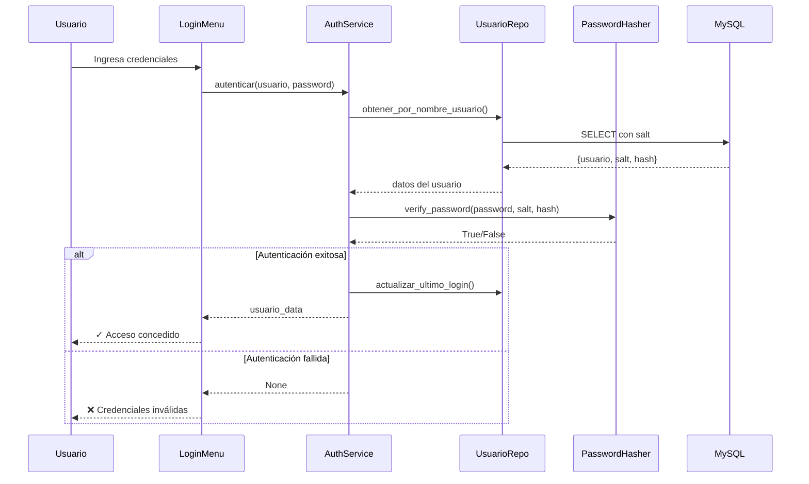
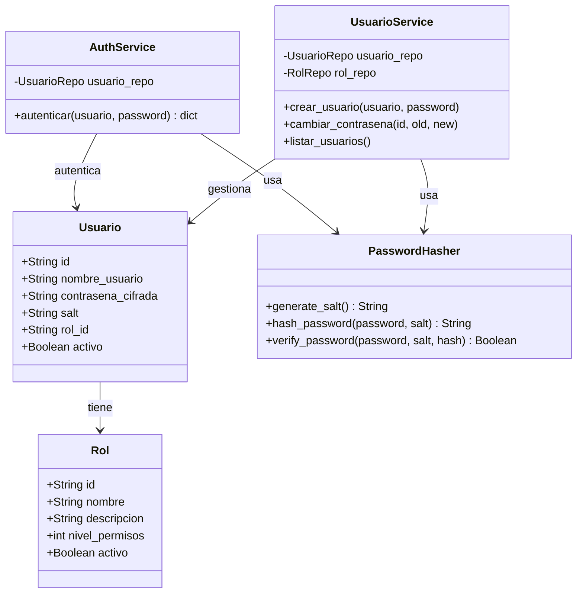

# Sistema de Autenticación y Gestión de Usuarios

## 🔐 Arquitectura de Seguridad

### Capas de Autenticación



## 🔑 Hashing de Contraseñas con Salt

### Proceso de Creación de Usuario

```python
# 1. Usuario ingresa contraseña en texto plano
password = "miPassword123"

# 2. Sistema genera salt único (32 bytes aleatorios)
salt = PasswordHasher.generate_salt()
# Ejemplo: "Xp2k9Qw7Zn3mL5vB8cR6tY4uI1oP0aS="

# 3. Combina contraseña + salt y hashea con SHA-256
hash = PasswordHasher.hash_password(password, salt)
# hash = sha256("miPassword123Xp2k9Qw7Zn3mL5vB8cR6tY4uI1oP0aS=")
# Resultado: "a7f3b2c9d1e5..."

# 4. Guarda en BD: salt y hash (NO la contraseña)
usuario.salt = salt
usuario.contrasena_cifrada = hash
```

### Proceso de Verificación (Login)

```python
# 1. Usuario ingresa contraseña
password_input = "miPassword123"

# 2. Recuperar salt y hash de la BD
usuario = db.get_user("admin")
salt = usuario['salt']
hash_almacenado = usuario['contrasena_cifrada']

# 3. Hashear contraseña ingresada con el mismo salt
hash_nuevo = PasswordHasher.hash_password(password_input, salt)

# 4. Comparar hashes
if hash_nuevo == hash_almacenado:
    return "Login exitoso"
else:
    return "Contraseña incorrecta"
```

### ¿Por qué usar Salt?

**Sin salt:**
```
Usuario A: password123 → hash: abc123def456
Usuario B: password123 → hash: abc123def456  (¡mismo hash!)
```
☠️ **Problema:** Si un atacante obtiene un hash, puede descubrir todos los usuarios con la misma contraseña.

**Con salt único:**
```
Usuario A: password123 + saltA → hash: abc123def456
Usuario B: password123 + saltB → hash: xyz789ghi012  (hash diferente)
```
✅ **Ventaja:** Cada usuario tiene un hash único incluso con la misma contraseña.

## 👤 Modelo de Datos

### Tabla usuarios

| Campo | Tipo | Descripción |
|-------|------|-------------|
| id | VARCHAR(50) | UUID único |
| nombre_usuario | VARCHAR(100) | Login único |
| contrasena_cifrada | VARCHAR(255) | Hash SHA-256 |
| **salt** | **VARCHAR(255)** | Salt único (base64) |
| rol_id | VARCHAR(50) | FK a roles |
| fecha_creacion | TIMESTAMP | Fecha de registro |
| ultimo_login | TIMESTAMP | Último acceso |
| activo | BOOLEAN | Usuario habilitado |

### Tabla roles

| Campo | Tipo | Descripción |
|-------|------|-------------|
| id | VARCHAR(50) | UUID único |
| nombre | VARCHAR(100) | Nombre del rol |
| descripcion | TEXT | Descripción |
| nivel_permisos | INT | 1-10 (prioridad) |
| activo | BOOLEAN | Rol habilitado |

## 🚀 Uso del Sistema

### Primera Ejecución

```bash
# 1. Levantar base de datos
docker-compose up -d
sleep 15

# 2. Inicializar datos (roles + usuario admin)
python init_data.py

# 3. Ejecutar aplicación
python main.py
```

### Credenciales Iniciales

```
Usuario: admin
Contraseña: admin123
Rol: Administrador (nivel 10)
```

⚠️ **Cambiar contraseña después del primer login**

### Flujo de Usuario

```
1. Pantalla de Login
   ├─ Máximo 3 intentos
   ├─ Contraseña oculta (getpass)
   └─ Validación de credenciales

2. Menú Principal (autenticado)
   ├─ Departamentos
   ├─ Proyectos
   ├─ Empleados
   ├─ Gestión de Usuarios
   ├─ Gestión de Roles
   └─ Cerrar Sesión
```

## 📋 Operaciones de Usuario

### Crear Usuario

```python
# Desde el menú: Gestión de Usuarios > Crear nuevo usuario

1. Ingresar nombre de usuario (mín 3 caracteres)
2. Seleccionar rol de la lista
3. Ingresar contraseña (mín 6 caracteres, oculta)
4. Confirmar contraseña

# Automáticamente:
- Genera salt único
- Hashea contraseña con SHA-256
- Almacena salt + hash en BD
```

### Cambiar Contraseña

```python
# Desde el menú: Gestión de Usuarios > Cambiar mi contraseña

1. Ingresar ID de usuario
2. Ingresar contraseña actual
3. Ingresar nueva contraseña (mín 6 caracteres)
4. Confirmar nueva contraseña

# Proceso:
- Verifica contraseña actual con salt + hash existente
- Genera nuevo salt
- Hashea nueva contraseña
- Actualiza BD con nuevo salt + hash
```

### Activar/Desactivar Usuario

```python
# Desde el menú: Gestión de Usuarios > Activar/Desactivar usuario

1. Ingresar ID de usuario
2. Confirmar acción (s/n)

# Efecto:
- Usuario desactivado NO puede iniciar sesión
- NO elimina el usuario de la BD
- Reversible
```

## 🛡️ Medidas de Seguridad Implementadas

### 1. **Hashing Seguro**
- Algoritmo: SHA-256
- Salt único por usuario (32 bytes)
- Contraseñas nunca almacenadas en texto plano

### 2. **Validación de Entrada**
```python
# Nombre de usuario
- Mínimo 3 caracteres
- Único en el sistema

# Contraseña
- Mínimo 6 caracteres
- Confirmación requerida
- Oculta con getpass
```

### 3. **Protección de Sesión**
- Máximo 3 intentos de login
- Actualización de último_login
- Usuarios inactivos no pueden autenticarse

### 4. **Consultas Parametrizadas**
```python
# ✅ CORRECTO
sql = "SELECT * FROM usuarios WHERE nombre_usuario = %s"
cursor.execute(sql, (usuario,))

# ❌ INSEGURO (SQL Injection)
sql = f"SELECT * FROM usuarios WHERE nombre_usuario = '{usuario}'"
cursor.execute(sql)
```

### 5. **Ocultación de Contraseñas**
```python
import getpass

# Contraseña no visible en terminal
password = getpass.getpass("Contraseña: ")
```

## 🧪 Testing

### Test de Autenticación

```bash
python test_auth.py
```

Verifica:
- Login exitoso con credenciales correctas
- Rechazo de contraseñas incorrectas
- Rechazo de usuarios inexistentes

### Test Manual

```bash
# 1. Login con admin
python main.py
# Usuario: admin
# Contraseña: admin123

# 2. Crear nuevo usuario
# Gestión de Usuarios > Crear nuevo usuario

# 3. Cerrar sesión y login con nuevo usuario
```

## 📊 Diagrama de Clases



## 🔄 Migración de Contraseñas

Si ya tienes usuarios sin salt:

```python
# Script de migración (ejemplo)
from persistencia.auth_repositorios import UsuarioRepo
from dominio.security import PasswordHasher

usuarios = UsuarioRepo().listar_todos()

for usuario in usuarios:
    if not usuario.get('salt'):
        # Generar salt y rehashear
        nuevo_salt = PasswordHasher.generate_salt()
        # Nota: Requiere contraseña en texto plano
        # (solicitar al usuario o resetear contraseña)
```

## 📚 Referencias

- [OWASP Password Storage](https://cheatsheetseries.owasp.org/cheatsheets/Password_Storage_Cheat_Sheet.html)
- [SHA-256 Wikipedia](https://en.wikipedia.org/wiki/SHA-2)
- [Salt (cryptography)](https://en.wikipedia.org/wiki/Salt_(cryptography))
