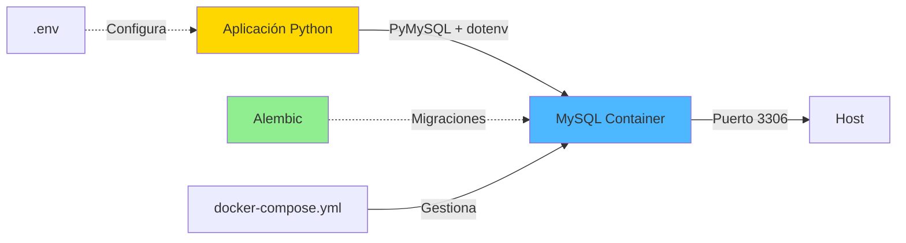
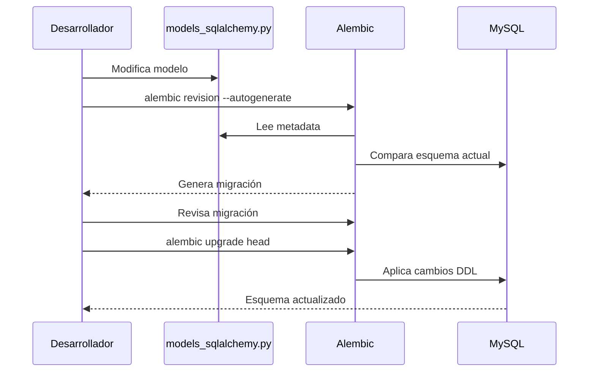

# Guía de Docker y Migraciones

## Arquitectura de Contenedores



## Docker Compose

El archivo `docker-compose.yml` define:
- **Imagen:** MySQL 8.0
- **Credenciales:** Usuario `ecotech_user` con contraseña `ecotech_pass`
- **Base de datos:** `ecotech_management` (auto-creada)
- **Puerto:** 3306 (mapeado al host)
- **Volumen:** Persistencia de datos en `mysql_data`
- **Inicialización:** Ejecuta `script.sql` al crear el contenedor por primera vez
- **Health check:** Verifica que MySQL esté listo

## Comandos Docker Esenciales

### Gestión de Contenedores

```bash
# Iniciar MySQL
docker-compose up -d

# Ver logs en tiempo real
docker-compose logs -f mysql

# Detener MySQL (conserva datos)
docker-compose down

# Detener y eliminar datos ⚠️
docker-compose down -v

# Reiniciar contenedor
docker-compose restart mysql

# Ver estado
docker-compose ps
```

### Acceso Directo a MySQL

```bash
# Conectarse como usuario de aplicación
docker exec -it ecotech_mysql mysql -u ecotech_user -pecotech_pass ecotech_management

# Conectarse como root
docker exec -it ecotech_mysql mysql -u root -prootpass

# Ejecutar consulta directa
docker exec -it ecotech_mysql mysql -u ecotech_user -pecotech_pass ecotech_management -e "SHOW TABLES;"
```

## Sistema de Migraciones con Alembic

### Estructura de Alembic

```
alembic/
├── versions/          # Archivos de migración
├── env.py            # Configuración (usa .env)
├── script.py.mako    # Template para migraciones
└── README

alembic.ini           # Configuración principal
persistencia/
└── models_sqlalchemy.py  # Modelos para autogenerate
```

### Flujo de Trabajo de Migraciones



### Comandos de Migración

```bash
# Crear migración automática (detecta cambios en models_sqlalchemy.py)
alembic revision --autogenerate -m "descripción del cambio"

# Crear migración manual vacía
alembic revision -m "descripción"

# Aplicar todas las migraciones pendientes
alembic upgrade head

# Aplicar hasta una revisión específica
alembic upgrade <revision_id>

# Revertir última migración
alembic downgrade -1

# Ver historial de migraciones
alembic history

# Ver migración actual
alembic current

# Ver SQL sin ejecutar
alembic upgrade head --sql
```

### Ejemplo: Agregar Campo a Tabla

**1. Modificar modelo SQLAlchemy:**

```python
# persistencia/models_sqlalchemy.py
class Departamento(Base):
    __tablename__ = 'departamentos'
    id = Column(String(50), primary_key=True)
    nombre = Column(String(100), nullable=False)
    descripcion = Column(Text)
    presupuesto = Column(DECIMAL(12, 2))  # ← NUEVO CAMPO
```

**2. Generar migración:**

```bash
alembic revision --autogenerate -m "Agregar presupuesto a departamentos"
```

**3. Revisar archivo generado en `alembic/versions/`:**

```python
def upgrade():
    op.add_column('departamentos', sa.Column('presupuesto', sa.DECIMAL(12, 2)))

def downgrade():
    op.drop_column('departamentos', 'presupuesto')
```

**4. Aplicar migración:**

```bash
alembic upgrade head
```

## Variables de Entorno (.env)

```bash
DB_HOST=127.0.0.1       # Host de MySQL (localhost desde host)
DB_PORT=3306            # Puerto de MySQL
DB_USER=ecotech_user    # Usuario de aplicación
DB_PASSWORD=ecotech_pass # Contraseña
DB_NAME=ecotech_management # Nombre de base de datos
```

**Importante:** El archivo `.env` está en `.gitignore` para no exponer credenciales.

## Solución de Problemas

### Error: Can't connect to MySQL server

```bash
# Verificar que el contenedor esté corriendo
docker-compose ps

# Si no está corriendo, iniciarlo
docker-compose up -d

# Esperar a que MySQL esté listo
sleep 15

# Verificar logs por errores
docker-compose logs mysql
```

### Error: Access denied for user

```bash
# Verificar credenciales en .env coinciden con docker-compose.yml
cat .env

# Recrear contenedor con credenciales limpias
docker-compose down -v
docker-compose up -d
```

### Error: Table already exists en migración

```bash
# Ver estado actual
alembic current

# Marcar base de datos como actualizada sin ejecutar
alembic stamp head

# O revertir y volver a aplicar
alembic downgrade base
alembic upgrade head
```

### Reiniciar Base de Datos Completamente

```bash
# ⚠️ ELIMINA TODOS LOS DATOS
docker-compose down -v
docker-compose up -d
sleep 15

# La base de datos se recrea desde script.sql
python test_db.py
```

## Integración con la Aplicación

La aplicación usa **PyMySQL** directamente para operaciones CRUD, mientras que **Alembic + SQLAlchemy** solo se usa para gestionar migraciones de esquema.

```python
# Conexión desde persistencia/db.py
from dotenv import load_dotenv
load_dotenv()  # Lee .env automáticamente

conn = Database.get_connection()  # Usa variables de .env
```

## Mejores Prácticas

1. **Nunca modificar migraciones ya aplicadas** - Crear nuevas migraciones en su lugar
2. **Revisar migraciones autogeneradas** - Alembic puede no detectar todos los cambios
3. **Usar transacciones** - Las migraciones se ejecutan en transacciones por defecto
4. **Hacer backup antes de migraciones grandes** - Especialmente en producción
5. **Mantener modelos SQLAlchemy sincronizados** - Aunque no se usen en runtime

## Referencias

- [Docker Compose Docs](https://docs.docker.com/compose/)
- [Alembic Tutorial](https://alembic.sqlalchemy.org/en/latest/tutorial.html)
- [PyMySQL Documentation](https://pymysql.readthedocs.io/)
